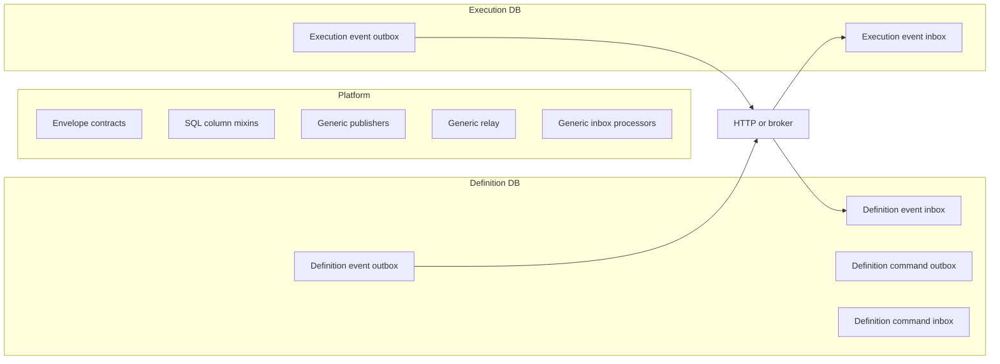

# Inbox i Outbox per Bounded Context

Status: propozycja architektury i plan migracji  
Data audytu: 2026-08-12
Aktualizacja: 2026-09-04 — opis dotyczy wyłącznie kanałów **Event** i
**Command**.

## Cel

Każdy bounded context powinien posiadać własne rekordy transportowe:

- event outbox,
- event inbox,
- command outbox,
- command inbox,
- audit event.

Platforma powinna dostarczać jedną implementację wspólnych modeli i mechanizmów:
modele `InboxEventModel`/`OutboxEventModel`, `InboxCommandModel`/`OutboxCommandModel`,
serializację, retry oraz generyczne
publisher'y, relay'e i procesory. Wszystkie BC korzystają z tych samych klas
platformowych na własnych bazach danych.

## Stan obecny

W repozytorium już istnieją:

- osobne SQLAlchemy bases dla bounded contexts, np. `DefinitionSqlAlchemyModelBase`, `ExecutionSqlAlchemyModelBase` i `UserSqlAlchemyModelBase`;
- platformowe factory/bundle’y modeli event, command i audit;
- serializery i deserializery eventów oraz komend;
- `SqlCommandOutboxWriter` / `SqlCommandDeliveryDispatcher` dla kontraktów tworzonych poza domenowym UoW;
- wspólny mechanizm relay dla eventów i komend;
- `EventInboxProcessor` i `CommandInboxProcessor`;
- baseline migrations dla poszczególnych bounded contexts;
- testy idempotencji relayów, transactional outbox i retry/DLQ inbox.

Aktualne modele znajdują się w:

```text
shell/platform/infrastructure/messaging/
shell/<bounded_context>/infrastructure/*/persistence/sql/models/
```

Ich tabele mają wspólne nazwy:

```text
event_outbox
event_inbox
command_outbox
command_inbox
```

Baseline każdego BC dołącza komplet modeli event/command/audit do własnego metadata.
Fizyczna izolacja wynika z osobnego `db_url` dla każdego BC. Wspólna implementacja
klas platformowych nie oznacza wspólnej bazy ani wspólnych danych.

## Najważniejsze obecne sprzężenia

Poniższe komponenty importują konkretne platformowe modele SQL:

- globalne importy modeli w runtime pozostają tylko jako kompatybilny fallback;
- docelowe modele są przekazywane przez `PersistenceDeliveryModels` albo jego bundle event/command;
- relay'e mogą używać osobnych `target_session_factory` i `target_models`;
- baseline'y używają modeli z metadata właściwego BC.

Nie znaleziono istniejących mapperów persistence dla inbox/outbox. `IntegrationEventMapper` mapuje eventy integracyjne i nie powinien być używany do mapowania technicznych rekordów transportowych.

## Docelowa struktura



Proponowana topologia:

```text
shell/platform/infrastructure/
    messaging/delivery/
        delivery_columns.py      # DeliveryColumnsMixin (payload, correlation_id, causation_id)
    messaging/
        event/
        command/
        inbox/

    shell/definition_service/infrastructure/definition/persistence/sql/models/base.py
    shell/execution_service/infrastructure/execution/persistence/sql/models/base.py
```

Analogiczne bazy BC korzystają z tych samych platformowych factory, ale rejestrują
własne klasy ORM w swoich metadata.

## Podział odpowiedzialności

### Platforma

Platforma posiada:

- kontrakty publisherów eventów i komend;
- kontrakty envelope i porty transportowe;
- serializery i deserializery;
- wspólne modele `InboxEventModel` i `OutboxEventModel`;
- retry, DLQ, idempotency i correlation/causation ID;
- generyczne publisher'y, relay'e i procesory konfigurowane zależnościami.

Platformowe modele są implementowane tylko raz. BC nie tworzą ich kopii; przekazują
platformowym adapterom własny `session_factory` i używają własnych migracji.

### Bounded context

Każdy BC posiada:

- własne `MetaData` i baseline;
- własny event registry;
- własny `session_factory`;
- własne konfiguracje publisherów i processorów;
- własne retry/DLQ policy, jeśli różni się od domyślnej.

Przy osobnych bazach danych nazwy tabel mogą pozostać takie same. Przy wspólnej bazie należy użyć osobnych schematów SQL albo prefiksów.

## Czy potrzebne są mappery?

Nie należy tworzyć klasycznych mapperów domenowych dla inbox/outbox. Są to techniczne
rekordy transportowe, obsługiwane przez wspólne modele i adaptery platformy. Mapper ma
sens dopiero dla jawnego przejścia:

```text
TransportEnvelope <-> Inbox/Outbox SQL row
```

## Plan migracji

### Faza 1: wspólna implementacja platformowa

Utrzymać jedną implementację modeli i adapterów inbox/outbox w `shell/platform/`.
Bundle modeli platformowych jest przekazywany do adapterów jako zależność.

### Faza 2: parametryzacja adapterów

Zmienić konstruktor platformowych komponentów tak, aby przyjmowały modele jako zależności:

```python
SqlEventOutboxPublisher(
    session_factory=session_factory,
    models=EVENT_DELIVERY_MODELS,
)
```

Analogicznie processor i relay otrzymują ten sam platformowy bundle modeli.

### Faza 3: Unit of Work

Zmienić `SqlAlchemyUnitOfWorkBase`, aby nie tworzył bezpośrednio platformowego `OutboxEventModel`.

Powinien przyjmować między innymi:

```python
    event_delivery_models: EventDeliveryModels
```

Każdy BC przekazuje ten sam platformowy bundle wraz z własnym `session_factory`.

### Faza 4: pozostałe BC

Podłączyć wspólny bundle platformowy w kontenerach:

- `execution`;
- `user`;
- `session`;
- `project`;
- `scheduling`;
    - `ingestion`.

Nie tworzyć kopii modeli. Każdy baseline tworzy te same tabele na bazie konkretnego BC.

### Faza 5: transport między bazami

Relay publikuje wyłącznie do transportu. Konsument brokera zapisuje wiadomość do
własnego inboxa; nie ma bezpośredniego toru outbox -> inbox.

Docelowy przepływ:

```text
Source BC outbox
    -> transport HTTP/broker
    -> Destination BC inbox
    -> Destination inbox processor
```

Relay nie importuje modelu inbox innego BC; otrzymuje docelowy bundle i session factory przez DI.

### Faza 6: usunięcie starych ścieżek kompatybilności

Po przepięciu wszystkich BC:

1. usunąć stare importy i alternatywne ścieżki modeli;
2. pozostawić jedną platformową implementację modeli;
3. zaktualizować seed data;
4. zaktualizować testy platformowe na modele testowe/fake;
5. dodać architektoniczny zakaz importu BC modeli transportowych przez platformę.

## Testy wymagane

### Testy metadata

- każdy BC rejestruje event/command/audit w swoim metadata;
- modele są zarejestrowane w metadata właściwego BC;
- platformowe metadata nie rejestruje modeli BC;
- każdy baseline tworzy komplet wymaganych tabel.

### Testy adapterów

- publisher zapisuje do outbox właściwego BC;
- processor czyta tylko inbox właściwego BC;
- UoW zapisuje event do outbox właściwego BC;
- relay nie importuje modeli docelowego BC;
- modele nie mają importów między bounded contexts.

### Testy transportu

- event przechodzi z outbox jednego BC do inbox drugiego BC;
- powtórzenie dostawy jest idempotentne;
- błędna deserializacja zwiększa retry;
- przekroczenie retry przenosi rekord do DLQ;
- correlation ID i causation ID są zachowane.

## Kryteria zakończenia

Refaktoryzację można uznać za zakończoną, gdy:

- żaden runtime BC nie używa globalnych modeli transportowych poza fallbackiem kompatybilnościowym;
- `SqlAlchemyUnitOfWorkBase`, publisher'y i processor'y są konfigurowane modelami przez DI;
- każdy BC tworzy własne tabele w swojej bazie;
- transport między BC nie korzysta ze wspólnego `session_factory`;
- testy architektury blokują importy modeli transportowych między BC;
- istnieją testy end-to-end z dwiema osobnymi bazami.

## Ryzyka

- zmiana UoW dotyka wszystkich agregatów i może zmienić transactional outbox;
- wspólne nazwy tabel są bezpieczne tylko przy osobnych bazach;
- event i command mają podobny lifecycle techniczny, ale zachowują osobne kontrakty i dispatch;
- migracja musi zachować istniejące rekordy, więc należy stosować migracje schematu, a nie samo `create_all` na produkcji;
- nie należy usuwać platformowych modeli przed przepięciem wszystkich BC i testów regresji.
